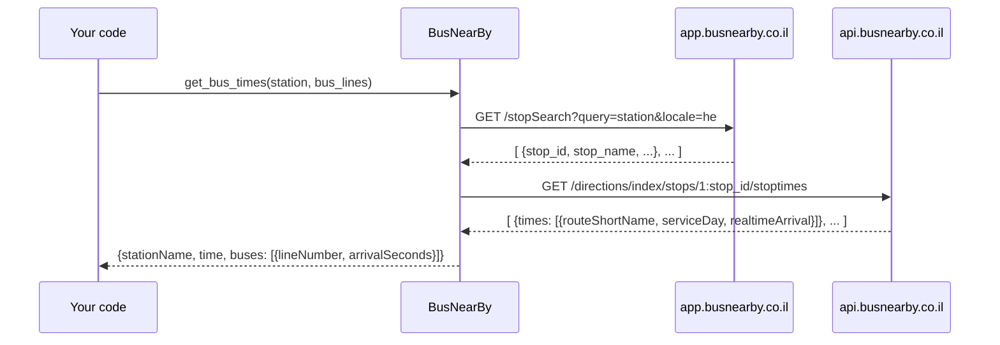

# py-busnearby

[](https://pypi.org/project/busnearby/)
[](https://github.com/t0mer/py-busnearby/blob/main/LICENSE)

An unofficial, asynchronous Python library that gets real-time bus arrival times for Israeli bus
stops from the [Bus Nearby](https://www.busnearby.co.il/) service. You give it a stop (usually the
stop code) and a list of bus lines, and it returns the stop name and the number of seconds until
each upcoming bus arrives. That makes it handy for scripts, dashboards and home-automation setups.

> **Disclaimer:** This project is **unofficial**. It is not affiliated with, endorsed by, or
> supported by Bus Nearby (busnearby.co.il). It uses the same web endpoints as the Bus Nearby web
> app, which are not a documented public API and may change or stop working at any time.

## Table of contents

- [Features](#features)
- [Requirements](#requirements)
- [Installation](#installation)
- [Quick start](#quick-start)
- [API reference](#api-reference)
- [Examples](#examples)
- [How it works](#how-it-works)
- [Troubleshooting](#troubleshooting)
- [Known issues and limitations](#known-issues-and-limitations)
- [Usage terms and security](#usage-terms-and-security)
- [Development](#development)
- [Contributing](#contributing)
- [License](#license)

## Features

- Look up a bus stop by its stop code (or any search text) and get its Hebrew name.
- Get real-time arrival estimates for the upcoming departures at that stop.
- Filter the results to the bus lines you care about.
- Results are sorted by arrival time and given in seconds from now.
- Fully `async`, built on [aiohttp](https://docs.aiohttp.org/).
- One runtime dependency (`aiohttp`).

## Requirements

- Python 3.7 or later (the `python_requires` declared in `setup.py`). Recent `aiohttp` releases
  need a newer Python; on an old interpreter pip installs an older compatible `aiohttp`.
- `aiohttp >= 3.8.0` (installed automatically).
- Network access to `app.busnearby.co.il` and `api.busnearby.co.il`.

## Installation

The package is published on PyPI as [`busnearby`](https://pypi.org/project/busnearby/):

```bash
pip install busnearby
```

To install the latest code from GitHub instead:

```bash
pip install git+https://github.com/t0mer/py-busnearby
```

Or from a local clone:

```bash
git clone https://github.com/t0mer/py-busnearby.git
cd py-busnearby
pip install .
```

## Quick start

To get bus times for a specific stop and bus lines, use the `get_bus_times` coroutine:

```python
import asyncio
from busnearby import BusNearBy

bus = BusNearBy()

async def main():
    station = "34501"               # example stop code; use your own
    bus_lines = "609,636,10,15"     # comma-separated, no spaces
    try:
        result = await bus.get_bus_times(station, bus_lines)
        print(result)
    except ValueError as e:         # stop not found
        print(f"Error: {e}")
    except RuntimeError as e:       # HTTP or decoding error
        print(f"Error: {e}")

asyncio.run(main())
```

Example output:

```json
{
    "stationName": "שדרות וייצמן/עקיבא",
    "time": "2024-07-22 13:10:43.974935",
    "buses": [
        {
            "lineNumber": "10",
            "arrivalSeconds": 644
        },
        {
            "lineNumber": "15",
            "arrivalSeconds": 1501
        },
        {
            "lineNumber": "609",
            "arrivalSeconds": 2210
        },
        {
            "lineNumber": "636",
            "arrivalSeconds": 3532
        },
        {
            "lineNumber": "636",
            "arrivalSeconds": 6728
        }
    ]
}
```

The printed value is a Python `dict`; it is shown here as JSON for readability.

## API reference

Everything lives in the `busnearby` package, which exposes a single class, `BusNearBy`.

### `BusNearBy()`

Takes no arguments. It sets:

| Attribute  | Value |
|------------|-------|
| `base_url` | `https://app.busnearby.co.il` |
| `headers`  | Browser-like request headers: a desktop Chrome `User-Agent`, `Accept: application/json, text/plain, */*`, `Accept-Language: en-US,en;q=0.5` and `Referer: https://app.busnearby.co.il/` |

The instance holds no connection; each `get_bus_times` call opens and closes its own
`aiohttp.ClientSession`, so one instance can be reused freely.

### `async get_bus_times(station: str, bus_lines: str) -> dict`

The main entry point.

| Parameter   | Type  | Description |
|-------------|-------|-------------|
| `station`   | `str` | Search text for the stop, normally the stop code (for example `"34501"`). The **first** search result is used. |
| `bus_lines` | `str` | Comma-separated line numbers, for example `"609,636,10,15"`. Values are compared as exact strings, so don't add spaces. |

Returns a `dict`:

| Key           | Type   | Description |
|---------------|--------|-------------|
| `stationName` | `str`  | Stop name as returned by Bus Nearby (Hebrew, `locale=he`). |
| `time`        | `str`  | Local time of the query, as `str(datetime.now())`, e.g. `"2024-07-22 13:10:43.974935"`. |
| `buses`       | `list` | Upcoming departures, sorted by `arrivalSeconds` ascending. Each item is `{"lineNumber": str, "arrivalSeconds": int}`. |

Filtering rules:

- Departures that are already in the past are dropped.
- If there are at least as many matching departures as requested lines, only departures of the
  requested lines are returned.
- Otherwise (for example, one of the requested lines has no upcoming departure), **all**
  upcoming departures at the stop are returned, unfiltered.
- The same line can appear more than once (see line `636` in the example above).

Raises:

| Exception      | When |
|----------------|------|
| `ValueError`   | The stop search returned no results (`"Station not found"`). |
| `RuntimeError` | An `aiohttp.ClientError` (connection error, connect or read timeout, an HTTP error status (4xx/5xx), non-JSON response) or a `json.JSONDecodeError` occurred. The message starts with `Error fetching or decoding data:`. |

Other errors propagate unchanged: an unexpected response shape raises `KeyError` or `IndexError`, and
hitting aiohttp's overall (`total`) request timeout raises a bare `asyncio.TimeoutError` (see
[Troubleshooting](#troubleshooting)).

### Lower-level coroutines

These are used by `get_bus_times` and can be called directly with your own
`aiohttp.ClientSession` (create it with `headers=bus.headers`). Both call `raise_for_status()` and
return the decoded JSON response as-is.

#### `async get_station_data(session: aiohttp.ClientSession, station: str) -> list`

Searches for a stop.
Request: `GET https://app.busnearby.co.il/stopSearch?query=<station>&locale=he`.
Returns a list of matching stops (annotated as `Dict` in the code, but the response is a list).
`get_bus_times` reads `stop_id` and `stop_name` from the first entry.

#### `async get_bus_times_data(session: aiohttp.ClientSession, stop_id: str, current_time: int) -> list`

Gets the upcoming departures at a stop.
Request: `GET https://api.busnearby.co.il/directions/index/stops/1:<stop_id>/stoptimes?numberOfDepartures=1&timeRange=86400&startTime=<current_time>&locale=he`,
where `current_time` is a Unix timestamp in seconds and the time range is 24 hours.
Returns a list of entries. `get_bus_times` reads `times[0].routeShortName`,
`times[0].serviceDay` and `times[0].realtimeArrival` from each; the arrival time in seconds is
`serviceDay + realtimeArrival - current_time`.

## Examples

### Print a simple departure board

```python
import asyncio
from busnearby import BusNearBy

async def main():
    # "34501" is an example stop code; use your own
    result = await BusNearBy().get_bus_times("34501", "609,636,10,15")
    print(result["stationName"])
    for bus in result["buses"]:
        minutes = bus["arrivalSeconds"] // 60
        print(f"  Line {bus['lineNumber']:>4}: {minutes} min")

asyncio.run(main())
```

### Query several stops concurrently

```python
import asyncio
from busnearby import BusNearBy

async def main():
    bus = BusNearBy()
    results = await asyncio.gather(
        bus.get_bus_times("34501", "10,15"),  # "34501" is an example stop code
        bus.get_bus_times("YOUR_STOP_CODE", "YOUR_LINE"),  # replace with a real stop and line
        return_exceptions=True,
    )
    for r in results:
        print(r)

asyncio.run(main())
```

### Use the lower-level calls with your own session

```python
import asyncio
from datetime import datetime
import aiohttp
from busnearby import BusNearBy

async def main():
    bus = BusNearBy()
    async with aiohttp.ClientSession(headers=bus.headers) as session:
        # "34501" is an example stop code; use your own
        stops = await bus.get_station_data(session, "34501")
        stop_id = stops[0]["stop_id"]
        now = int(datetime.now().timestamp())
        departures = await bus.get_bus_times_data(session, stop_id, now)
        print(stops[0]["stop_name"], len(departures), "entries")

asyncio.run(main())
```

## How it works



## Troubleshooting

- **`ValueError: Station not found`**: the stop search returned nothing. Check the stop code
  (it's shown on the stop sign and on the Bus Nearby site).
- **Wrong stop returned**: only the first search result is used. Search by the numeric stop code
  rather than a name.
- **`RuntimeError: Error fetching or decoding data: ...`**: the request failed (including a
  connect or read timeout), returned an HTTP error status (4xx/5xx), or the response wasn't JSON. The service may be down, may have changed its endpoints,
  or may be blocking your requests.
- **You get lines you didn't ask for**: at least one requested line had no upcoming departure, so
  the library returned all departures (see the filtering rules above). Also make sure
  `bus_lines` has no spaces: `"10, 15"` does not match line `15`.
- **`KeyError` or `IndexError`**: the response didn't have the expected shape (for example, an
  entry with an empty `times` list). These are not wrapped in `RuntimeError`, so catch them
  yourself if you need to.
- **Hangs for a long time, then `asyncio.TimeoutError`**: no custom timeout is set, so `aiohttp`'s
  default overall (`total`) timeout applies, and hitting it raises a bare `asyncio.TimeoutError`
  (not `RuntimeError`). Wrap the call in `asyncio.wait_for(...)` if you need a shorter limit.

## Known issues and limitations

- Relies on undocumented Bus Nearby web endpoints; any change on their side can break it.
- When a requested line is missing, the result is silently unfiltered instead of an error or an
  empty list. The check compares the number of matching departures to the number of requested
  lines, so repeated departures of one line can also hide a missing line.
- `bus_lines` entries are not trimmed, so spaces break matching.
- The `time` field is a naive local timestamp, taken slightly after the arrival times were
  calculated.
- Only the first departure time of each entry is used (`numberOfDepartures=1`).
- Stop IDs are always sent with the `1:` feed prefix.
- There are no tests.

## Usage terms and security

- Use this library responsibly. Respect Bus Nearby's terms of use and don't overload the
  service: poll at a sensible interval and cache results where you can.
- Arrival times are estimates from a third-party service. Don't rely on them for anything
  safety-critical.
- The library needs no credentials or API keys and stores no data. It only makes HTTPS `GET`
  requests to the two Bus Nearby hosts listed above.
- Requests use a fixed, browser-like `User-Agent` header.

## Development

Project layout:

```
busnearby/__init__.py              # the BusNearBy class (all the code)
setup.py                           # package metadata (name "busnearby", aiohttp dependency)
.github/workflows/python-publish.yml
LICENSE
```

Set up a local environment:

```bash
git clone https://github.com/t0mer/py-busnearby.git
cd py-busnearby
python -m venv .venv && source .venv/bin/activate
pip install -e .
```

Build the package:

```bash
pip install build
python -m build
```

Releases: the `Publish pypi package` workflow builds the package and uploads it to PyPI with the
`PYPI_API_TOKEN` secret. It runs when a GitHub release is published or when started manually
(`workflow_dispatch`). The version number is set in `setup.py`.

## Contributing

Contributions are welcome! Please open an issue or submit a pull request on
[GitHub](https://github.com/t0mer/py-busnearby).

## License

This project is licensed under the Apache License 2.0. See
[LICENSE](https://github.com/t0mer/py-busnearby/blob/main/LICENSE).
<!-- TODO: verify - setup.py (and the PyPI metadata) declare license='MIT', but the LICENSE file is Apache 2.0 -->
